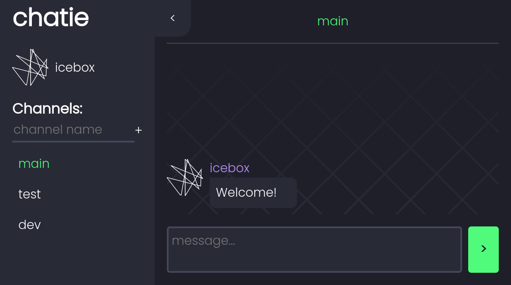

# chatie



Simple online chatting app.

Available on [chatienow.herokuapp.com](https://chatienow.herokuapp.com/) as webapp and installable PWA.

Written in JavaScript, designed to run on NodeJS backend. 
Communication is based on REST API and WebSockets.

Frontend interface is written using [Vue.js](https://vuejs.org/).

Avatars are procedurally generated based on usernames.

## Running an instance

Application uses environmental variables for configuration:

- `DATABASE_URL` - connection string URL used to connect to Postgresql database
- `PORT` - port on which application will listen

```console
npm i
npm start
```

